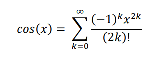

# MPI

  
  

## Introduction

  

A C program that uses MPI parallelization to compute the value of cos(x) using the above 
formula. You need to get the upper value of i and the value of x from the user, where your 
program makes the computation by dividing i equally among the processes, it should use n
processes to do this computation, where n is provided as input by user. Then, it displays the 
computed value of cos(x). You need to display to the user the value of cos(x) and the time taken 
by the program to compute it. You need also, to do the sequential version of this computation to 
the same accuracy, compute the time you program takes in each case, and compare the time for 
parallel version to the one computed in sequential version. Also, you need to discuss the differences 
in these times as the number of computing processes changes.

## How to run
In order to run MPI program:

    Step 1: Download MPI SDK
    Step 2: Run both .exe and .msi file of MPI SDK
    Step 3: Download Visual Studio
    Step 4: Open command prompt window in the cos_assignment/Debug folder
    Step 5: Run this command mpiexec -n number_of_processes cos_assignment.exe 
    Step 6: Input the requested parameters n, K and x in order

In order to run Serial program:

    Step 1: Download Visual Studio to be able to open the project
    Step 2: Run the exe file in the serial_cos/Debug folder
    Step 3: Input the requested parameters K and x in order
